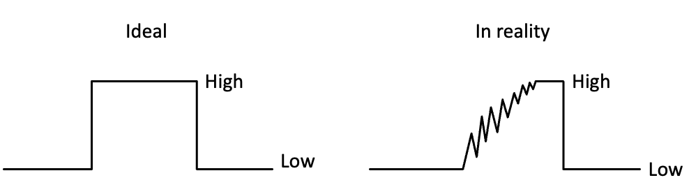
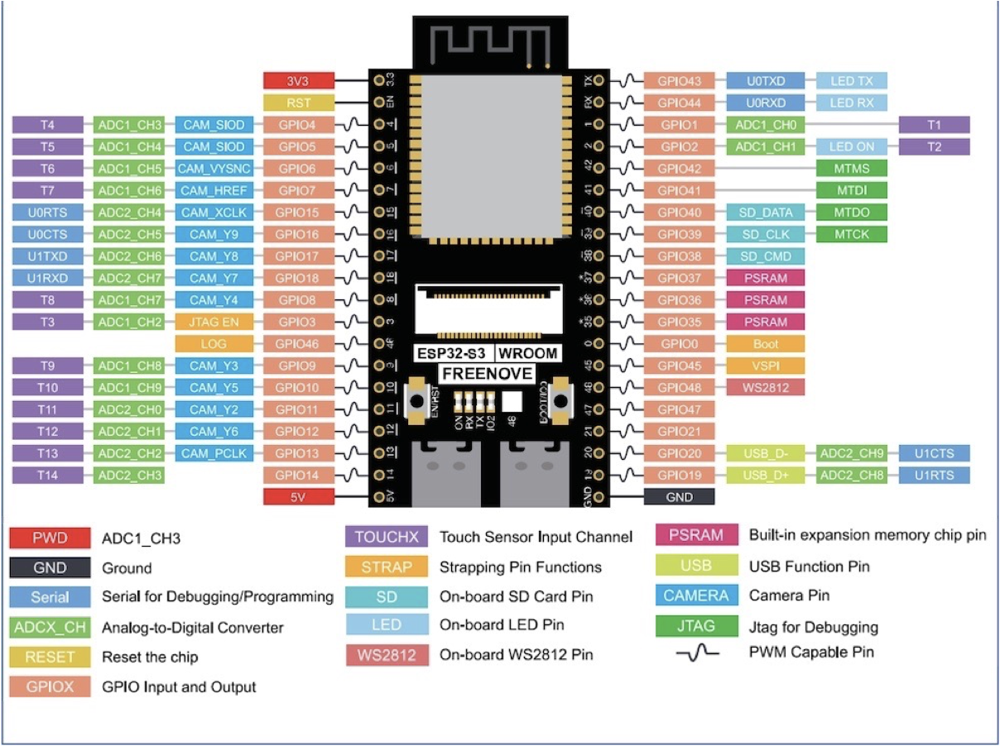

# NOTE

## Lab 7 note

### Buzzer, Water Level Sensor, and Photoresistor


## Lab 6 note

### Wifi, AP Mode

When you set the ESP32 as an access point (hotspot), it allows you to connect to the ESP32 using any Wi-Fi-enabled device without requiring a connection to your router.

### Web Server
Using Web Sever to Control ESP32

## Lab 4 note


### Serial Port


### LCD with I2C


## Lab 3 note

### pwm: 模擬呼吸燈

- Pulse Width Modulation (PWM)，脈衝寬度調製，簡稱脈寬調製。
- PWM 信號仍然是數位的，因為在給定的任何時刻，直流供電要麼是 3.3V（ON），要麼是 0V（OFF） 。
- 輸出電壓 =（接通時間/脈衝時間）\* 最大電壓值
- PWM 週期要短才有效
- 使用 ESP32 ADC pins

### dht11: 溫溼度感測器

### ultrasonic: HC-SR04 超聲波感測器

- measure distance
- 使用 HC-SR04
- 距離測量物體不可以太近、太遠、角度太大、材質需能反彈聲波
  - 距離太近會無法沒辦法將訊號反射到接受器，
  - 距離太遠則會因為訊號衰減或受到干擾，導致超音波回傳。
- (單程)距離 = 時間 \* 0.34 / 2 =時間 / 58.2

## Lab 2 note

### 按鍵開關

Bounce (彈跳、震盪)：

- Pushbuttons often generate spurious open/close transitions when pressed, due to mechanical and physical issues.
- These transitions may be read as multiple presses in a very short time fooling the program.
- 

### Debounce (反彈跳)

- 可以用 delay 一段時間躲過但這方法不好，Ex: [lab2-state-change-detection](./lab2/state-change-detection/StateChangeDetection.ino)
- 改進：`millis() - lastDebounceTime`，Ex: [lab2-debounce](./lab2/Debounce/Debounce.ino)

## Lab 1 note

### delay  的缺點

- 在 delay() 期間，不能讀取感測器、不能做數學運算、不能處理 pin 腳信號，也就是說它會讓大部分的動作都停擺。
- 在  delay()  期間，CPU 還是可以做某些事情，例如：序列埠的 RX pin 腳進來的資料會被紀錄下來。

### Blink without Delay

https://www.arduino.cc/en/Tutorial/BuiltInExamples/BlinkWithoutDelay

> Turns on and off a light emitting diode (LED) connected to a digital pin, without using the `delay()` function. \
> This means that other code can run at the same time without being interrupted by the LED code.

The code below uses the `millis()` function, a command that returns the number of milliseconds since the board started running its current sketch, to blink an LED.

```cpp
const int ledPin = LED_BUILTIN;
int ledState = LOW;

// Generally, you should use "unsigned long" for variables that hold time
// The value will quickly become too large for an int to store
unsigned long previousMillis = 0;  // will store last time LED was updated
const long interval = 1000;  // interval at which to blink (milliseconds)

void setup() {
  pinMode(ledPin, OUTPUT);
}

void loop() {
  // check to see if it's time to blink the LED; that is, if the difference
  // between the current time and last time you blinked the LED is bigger than
  // the interval at which you want to blink the LED.
  unsigned long currentMillis = millis();

  if (currentMillis - previousMillis >= interval) {
    // save the last time you blinked the LED
    previousMillis = currentMillis;

    if (ledState == LOW) {
      ledState = HIGH;
    } else {
      ledState = LOW;
    }

    digitalWrite(ledPin, ledState);
  }
}

```

### LAB 0 note

ESP32-S3-WROOM CAM

